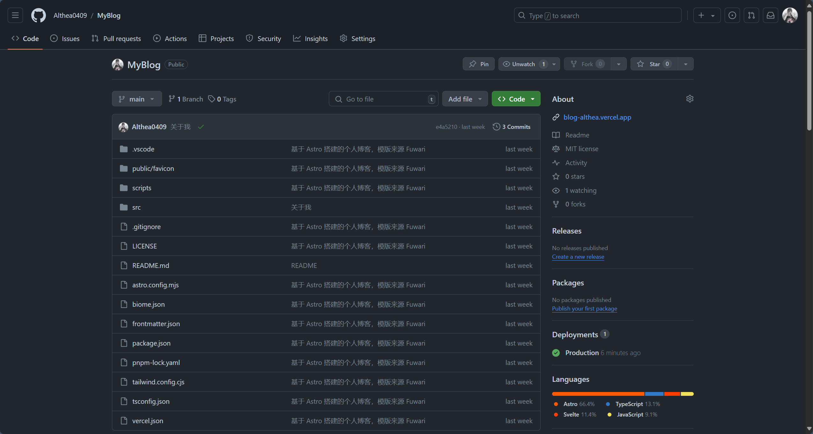
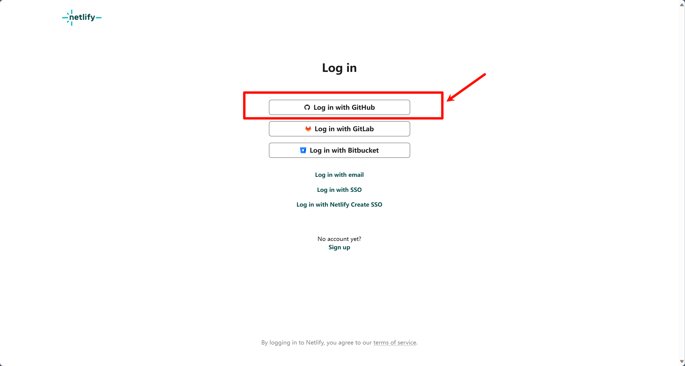
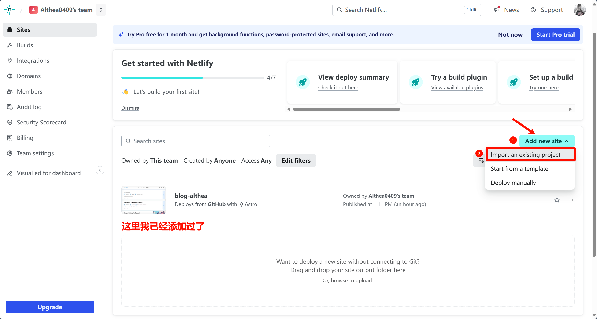
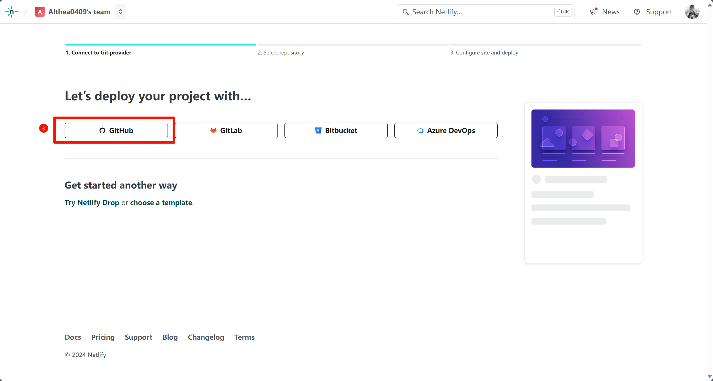
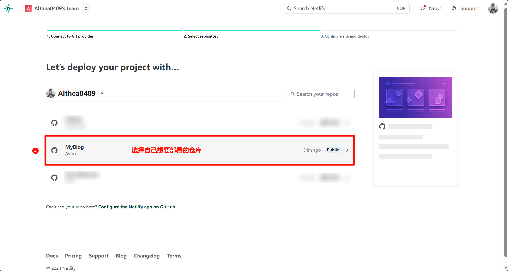
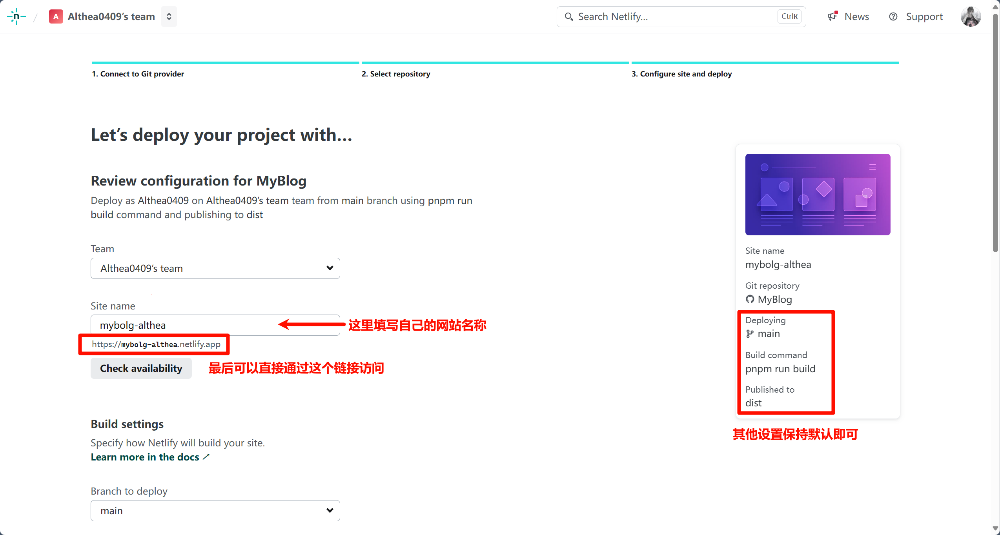
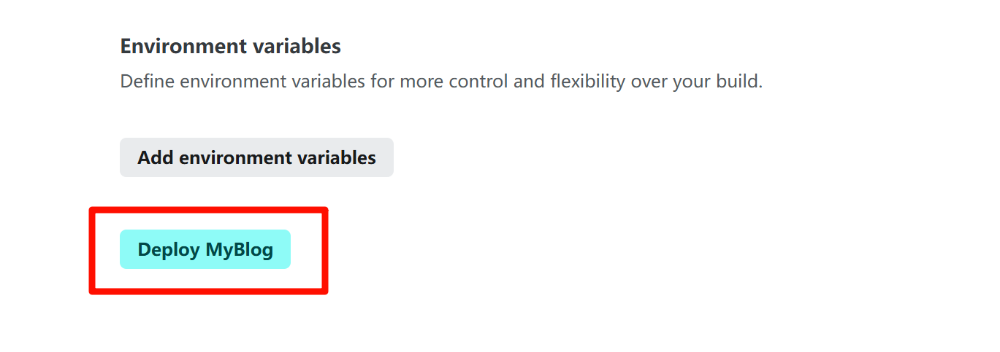
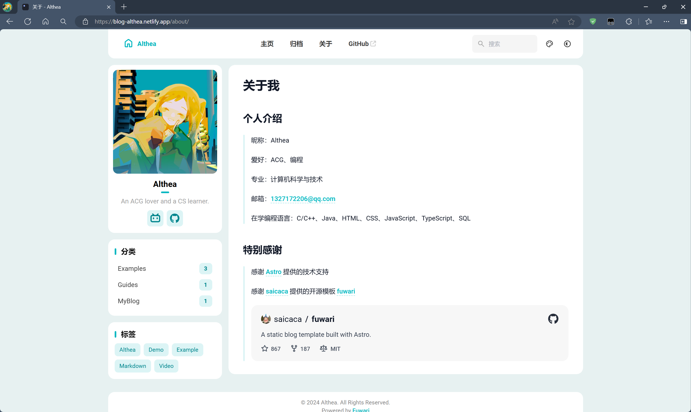

## 部署步骤

### 1. 创建 GitHub 仓库

首先，我们需要创建一个 GitHub 仓库，并将博客源码上传到仓库中。

### 2. 通过 GitHub 登录 netlify 账号

接着，我们直接通过 GitHub 登录 [netlify](https://www.netlify.com/) 账号。

### 3. 导入 GitHub 仓库

按照步骤，先导入自己的 GitHub 仓库，然后选择需要部署的仓库，

### 4. 配置部署环境

然后，我们需要配置部署环境。

### 5. 部署成功

最后，我们点击最下方的部署按钮，等待一小段时间，即可部署成功。

### 6. 访问博客

部署成功后，我们可以直接通过刚刚设置的属于自己的 [Netlify](https://blog-althea.netlify.app/) 域名访问博客啦！

## 参考资料

> Astro 官方部署文档：[https://docs.astro.build/zh-cn/guides/deploy/](https://docs.astro.build/zh-cn/guides/deploy/)